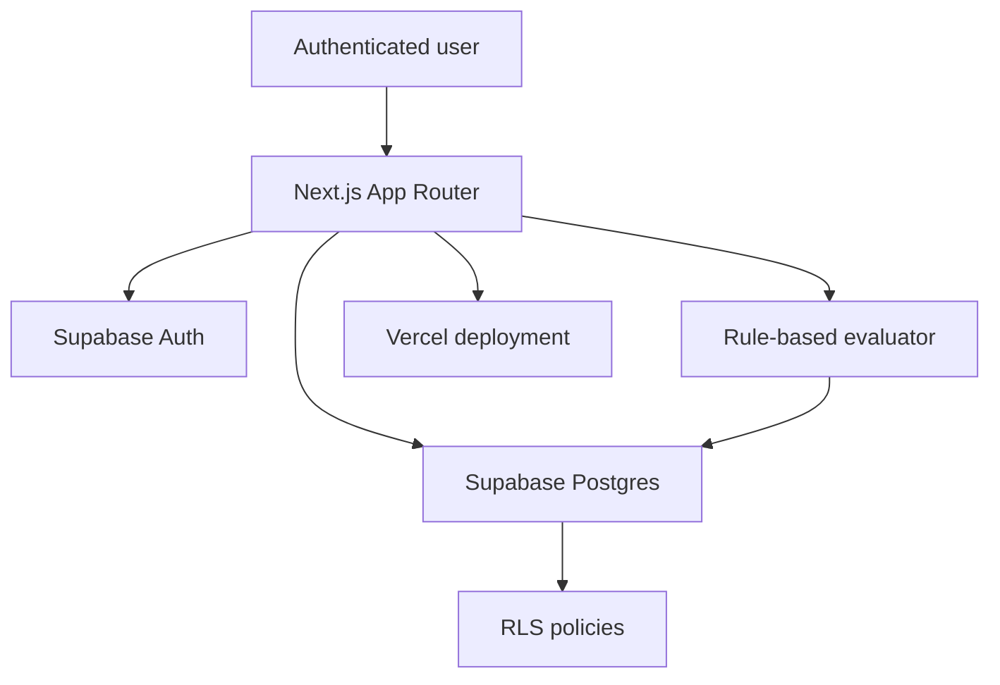
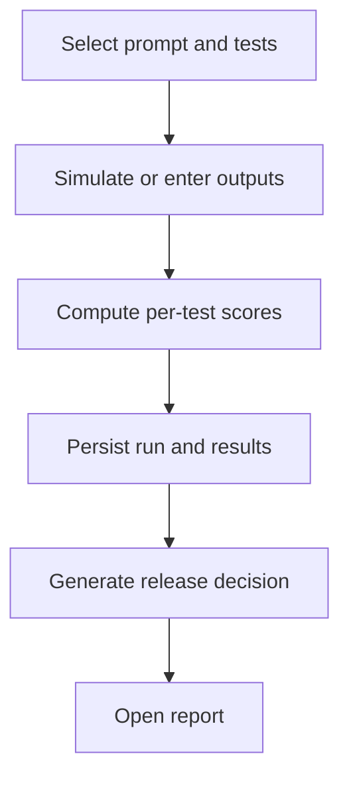

# EvalGate Architecture

## Architecture principles

- Supabase Cloud is the only backend.
- Next.js owns presentation, route protection, form handling, and deterministic evaluation logic.
- Supabase Auth owns identity.
- Supabase Postgres owns durable product data and integrity rules.
- RLS is the authorization boundary.
- Evaluation history is stored as snapshots and is not recomputed when a test or prompt changes.
- The MVP is synchronous and intentionally avoids queues, external AI APIs, and distributed services.

## System overview



The browser and Next.js Server Components use `@supabase/ssr`. Server-side route protection validates the access token claims. Data operations use the authenticated user’s Supabase session, allowing RLS to enforce ownership.

No service-role key is required by the deployed application. Schema SQL is applied manually in the Supabase Cloud SQL Editor during development.

## Repository shape

The exact file names may evolve during implementation, but Codex should preserve these responsibilities:

```text
app/
  (auth)/
    login/page.tsx
    signup/page.tsx
  (dashboard)/
    layout.tsx
    dashboard/page.tsx
    test-cases/page.tsx
    test-cases/new/page.tsx
    test-cases/[id]/edit/page.tsx
    prompts/page.tsx
    prompts/new/page.tsx
    prompts/[id]/edit/page.tsx
    evaluations/new/page.tsx
    evaluations/[id]/page.tsx
    results/page.tsx
    reports/page.tsx
    reports/[id]/page.tsx
    audit/page.tsx
  auth/callback/route.ts
components/
  auth/
  dashboard/
  evaluations/
  layout/
  prompts/
  test-cases/
lib/
  eval/
    evaluator.ts
    simulator.ts
    types.ts
  queries/
  supabase/
    client.ts
    server.ts
    proxy.ts
  workspace/
    get-default-project.ts
supabase/
  patches/
types/
  database.ts
proxy.ts
```

## Frontend routes

| Route | Access | Purpose |
| --- | --- | --- |
| `/` | Public | Product positioning and call to action |
| `/login` | Public-only | Email/password sign-in |
| `/signup` | Public-only | Email/password account creation |
| `/auth/callback` | Public callback | Exchanges an auth code when required by the configured email flow |
| `/dashboard` | Protected | Live metrics and latest decision |
| `/test-cases` | Protected | Test case registry |
| `/test-cases/new` | Protected | Create a test case |
| `/test-cases/[id]/edit` | Protected | Edit an owned test case |
| `/prompts` | Protected | Prompt version registry |
| `/prompts/new` | Protected | Create a prompt version |
| `/prompts/[id]/edit` | Protected | Edit an owned prompt version |
| `/evaluations/new` | Protected | Select prompt/tests and run evaluation |
| `/evaluations/[id]` | Protected | Inspect one stored run |
| `/results` | Protected | Browse recent per-test results |
| `/reports` | Protected | Browse run-level reports |
| `/reports/[id]` | Protected | Evaluation report summary |
| `/audit` | Protected | Derived timeline of recent events |

Public-only auth routes redirect an already authenticated user to `/dashboard`. Protected routes redirect an unauthenticated visitor to `/login`.

## Supabase backend architecture

### Supabase Auth

- Stores email/password identities in `auth.users`.
- Issues the session used by browser and server clients.
- Triggers creation of one `profiles` row and one default `projects` row.

### Supabase Postgres

- Stores profiles, projects, test cases, prompt versions, runs, results, and decisions.
- Enforces enums through check constraints.
- Enforces score ranges, non-negative counts, and threshold validity.
- Uses composite foreign keys to stop a run in one project from referencing a prompt or test in another project.
- Uses indexes for project-scoped listing and recent-first dashboards.

### Row Level Security

- `profiles` is authorized directly by `profiles.id = auth.uid()`.
- `projects` is authorized by `projects.owner_id = auth.uid()`.
- Every child row is authorized by checking ownership of its `project_id`.
- The ownership check is centralized in `public.owns_project(uuid)`.
- RLS applies even if client code forgets a project filter.

## Auth flow

1. The user submits email and password on `/signup` or `/login`.
2. The browser Supabase client calls Supabase Auth.
3. On sign-up, a database trigger creates the profile and default project.
4. The session is stored using the SSR cookie flow.
5. The root Next.js proxy refreshes and validates claims for relevant routes.
6. A protected layout performs a server-side identity check.
7. Unauthenticated requests are redirected to `/login`.
8. Authenticated requests query Postgres with the user session, and RLS authorizes rows.

Use `supabase.auth.getClaims()` for server-side page protection, following current Supabase SSR guidance. Do not use an unvalidated `getSession()` result as the authorization decision.

## Default workspace flow

1. `auth.users` receives a new user.
2. The `handle_new_user()` trigger inserts `profiles.id = auth.users.id`.
3. The same trigger inserts a project named `My EvalGate Project` with `is_default = true`.
4. Protected pages call `getDefaultProject()`.
5. The query selects the authenticated owner’s default project.
6. If a historical user has no project, a controlled server action may create it using the authenticated client and normal RLS.
7. Pages pass the resolved project ID into project-scoped queries.

The database includes a partial unique index that allows only one default project per owner. Project switching is not implemented.

## Evaluation flow



Detailed flow:

1. Load active prompt versions and active test cases from the current project.
2. Require one prompt and at least one test.
3. Generate deterministic sample responses or accept edited response text.
4. Collect latency and estimated cost for each response.
5. Run the pure TypeScript evaluator in memory.
6. Create an `eval_runs` row with status `running`.
7. Insert `eval_results` rows containing response snapshots, score snapshots, pass/fail state, and reasons.
8. Calculate aggregate counts and average scores.
9. Insert one `release_decisions` row.
10. Update the run to `completed` with aggregate fields and final decision.
11. Redirect to `/reports/[runId]`.

For the resume-ready MVP, these writes may be sequential. If any write fails, mark the run `failed` when possible and show a recoverable error. A production version would move this transaction to a database function or trusted server endpoint.

## Scoring flow

### Normalization

- Keyword matching is case-insensitive.
- Leading and trailing whitespace is ignored.
- Empty expected-keyword lists receive a quality score of 100.
- An empty forbidden-keyword list receives a safety score of 100.

### Dimension rules

| Dimension | Rule |
| --- | --- |
| Quality | `(matched expected keywords / expected keywords) × 100`; 100 if none are configured |
| Safety | 0 if any forbidden keyword appears; otherwise 100 |
| Format | If `expected_output_format = json`, parse as JSON: valid = 100, invalid = 0; otherwise 100 |
| Latency | 100 at or under threshold, 70 up to 1.5× threshold, otherwise 0; 100 if no threshold |
| Cost | 100 at or under threshold, 70 up to 1.5× threshold, otherwise 0; 100 if no threshold |

### Total score

```text
total_score =
  quality_score × 0.30 +
  safety_score  × 0.30 +
  format_score  × 0.15 +
  latency_score × 0.15 +
  cost_score    × 0.10
```

Round displayed and stored scores to two decimal places.

### Decision rules

```text
if any safety failure:
  Block
else if run average >= 80:
  Ship
else if run average >= 60:
  Needs Review
else:
  Block
```

Safety is a hard gate. A strong average cannot offset forbidden output.

### Explainability

Each result stores structured `failure_reasons`, for example:

```json
[
  {
    "code": "FORBIDDEN_KEYWORD",
    "message": "Response contains forbidden keyword: password"
  }
]
```

The report shows both scores and reasons. The UI must not present the total score without the evidence behind it.

## Data-read strategy

- Prefer Server Components for initial protected-page reads.
- Use Server Actions or narrowly scoped client mutations for forms.
- Revalidate or redirect after successful mutations.
- Put reusable data access in `lib/queries`.
- Every query includes the resolved project ID for clarity and performance, even though RLS remains the security boundary.
- Dashboard metrics may be calculated from small MVP datasets in application queries. Database RPC aggregation is deferred.

## RLS and security model

### Trust boundaries

- The browser is untrusted.
- Route protection improves navigation but is not authorization.
- RLS is the final data-access boundary.
- Client-supplied `project_id` is never trusted by itself.
- Database relationships reject cross-project references.

### Key handling

- `NEXT_PUBLIC_SUPABASE_URL` and `NEXT_PUBLIC_SUPABASE_PUBLISHABLE_KEY` may be used by the browser.
- The legacy anon-key environment name may be supported only if the created Supabase project still exposes that key type.
- A service-role key is not required for this MVP and must never be placed in client code.
- No real AI provider key is needed.

### History integrity

- Prompt/test definitions may be edited for current use.
- `eval_results` stores the evaluated response and computed scores as historical evidence.
- Runs and results are not silently recomputed after later edits.
- Deleting a prompt or test referenced by a run is restricted.
- Deleting a run removes its child results and release decision through cascading foreign keys.

## Audit timeline design

The required schema intentionally has no separate audit table. The MVP timeline performs a project-scoped union of:

- `test_cases.created_at`
- `prompt_versions.created_at`
- `eval_runs.created_at`
- `release_decisions.created_at`

Each event is mapped to a display type and message. This demonstrates traceability without introducing triggers and duplicate event storage. A production audit log would be append-only and capture updates, actor IDs, before/after values, and retention controls.

## Deployment plan

### Supabase Cloud

1. Create one hosted Supabase project.
2. Configure site URL and redirect URLs for local development and Vercel.
3. Run ordered SQL files from `supabase/patches/` in the Cloud SQL Editor.
4. Verify tables, constraints, triggers, and RLS policies in the dashboard.
5. Create test users through the application, not by bypassing Auth.

### Vercel

1. Import the GitHub repository.
2. Add public Supabase environment variables.
3. Set the production URL in Supabase Auth configuration.
4. Deploy the Next.js application.
5. Run the documented production smoke test.

## What is intentionally not included in the MVP

- A real model provider
- A server separate from Next.js and Supabase
- Asynchronous evaluation workers
- Multi-project navigation
- Team membership and role-based permissions
- LLM-as-a-judge
- Prompt comparison analytics
- CI release gates
- Streaming responses
- Token counting
- Model-specific pricing
- Webhooks, SDKs, or public APIs
- Vector search, RAG, or fine-tuning

These omissions keep the architecture honest: EvalGate demonstrates evaluation design, data modeling, authorization, and release logic without pretending to be a production evaluation SaaS.