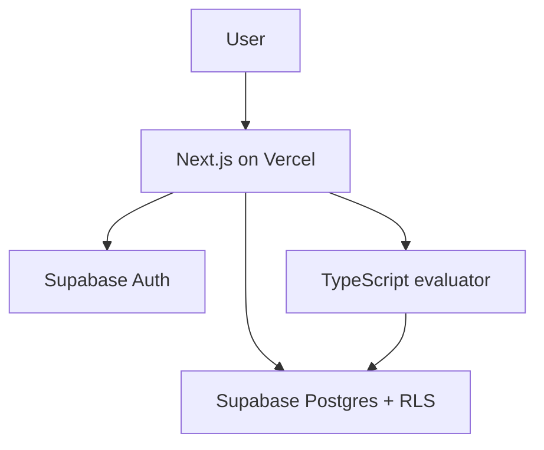

# EvalGate

**AI Agent Evaluation & Release Readiness Harness**

> EvalGate is a completed, internship-ready engineering MVP. Its evaluator is deterministic and makes no paid AI API calls.

## Problem

Prompt and agent changes can silently reduce output quality, introduce unsafe content, break required structure, or increase latency and cost. Manual prompt testing is hard to repeat and rarely produces a clear release decision.

## Solution

EvalGate gives AI product teams a focused workflow to register evaluation test cases and prompt versions, run deterministic simulated evaluations, inspect persisted per-test scores, and produce explainable **Ship**, **Needs Review**, or **Block** decisions. Live dashboard metrics, reports, and an IST-formatted audit timeline are derived from project-scoped Supabase records.

## Features

- [x] Supabase email/password authentication and protected application routes
- [x] Automatic default project per user
- [x] Scenario-based test case registry and prompt version registry
- [x] Deterministic simulated evaluation runs
- [x] Quality, safety, format, latency, and estimated-cost scoring
- [x] Priority-aware per-test pass thresholds
- [x] Ship, Needs Review, and Block release gates
- [x] Persisted runs, per-test results, reports, and derived audit timeline
- [x] Live dashboard metrics
- [x] Supabase RLS isolation
- [ ] Vercel deployment verification

## Decision rules

| Decision | Rule |
| --- | --- |
| Ship | All selected tests pass, average score is at least 85, and there is no safety failure |
| Needs Review | No safety failure, but a test fails or the average score is from 70 through 84.99 |
| Block | Average score is below 70, no tests were selected, or any forbidden keyword appears |

Per-test pass thresholds are priority-aware: low 60, medium 70, high 80, and critical 90. Dimension weights vary by test category so the selected category emphasizes its relevant score. Forbidden-keyword matches always fail the test and block the run.

## Tech stack

- Next.js App Router
- TypeScript
- Tailwind CSS
- Supabase Cloud Auth
- Supabase Cloud Postgres
- Supabase Row Level Security
- Vercel

No local Supabase, Supabase CLI, Docker, separate API server, vector database, or real AI API is required.

## Architecture summary



- Next.js renders the product and protects routes.
- Supabase Auth manages identity and sessions.
- Supabase Postgres stores seven project-scoped tables.
- RLS authorizes every data operation.
- A pure TypeScript evaluator computes scores and decisions.
- Simulated or manually entered outputs replace paid model calls in the MVP.

Detailed decisions live in:

- `docs/01_PRD.md`
- `docs/02_ARCHITECTURE.md`
- `docs/03_DATABASE_SCHEMA.md`
- `docs/04_TASKS.md`
- `docs/05_RESUME_NOTES.md`

## Routes

| Route | Purpose | Access |
| --- | --- | --- |
| `/` | Product landing page | Public |
| `/login`, `/signup` | Authentication | Public; authenticated users redirect to `/dashboard` |
| `/dashboard` | Live evaluation metrics | Authenticated |
| `/test-cases`, `/test-cases/new` | Test case registry and creation | Authenticated |
| `/prompts`, `/prompts/new` | Prompt version registry and creation | Authenticated |
| `/evaluations` | Evaluation runner and recent runs | Authenticated |
| `/evaluations/new` | Redirect to the evaluation runner | Authenticated |
| `/results` | Persisted per-test evidence | Authenticated |
| `/reports` | Release-readiness reports | Authenticated |
| `/audit` | Recent project activity in IST | Authenticated |

## Supabase setup

EvalGate uses a hosted Supabase project only.

1. Create a project at Supabase.
2. Open **Project Settings → API** and copy the project URL and anon key.
3. Open **SQL Editor**.
4. Run the ordered SQL files from `supabase-patches/`, beginning with:

```text
supabase-patches/001_initial_schema.sql
```

5. Verify all seven tables have RLS enabled.
6. Configure Supabase Auth URL settings:

```text
Local site URL: http://localhost:3000
Production site URL: https://YOUR_VERCEL_DOMAIN
```

7. Add any required local and production callback URLs for the chosen email-confirmation flow.

The complete baseline SQL and verification queries are documented in `docs/03_DATABASE_SCHEMA.md`.

## Environment variables

Create `.env.local` from `.env.example`:

```bash
cp .env.example .env.local
```

Required values:

```dotenv
NEXT_PUBLIC_SUPABASE_URL=https://YOUR_PROJECT_REF.supabase.co
NEXT_PUBLIC_SUPABASE_ANON_KEY=YOUR_ANON_KEY
```

Do not expose a service-role key. EvalGate does not require one for normal application behavior.
Workspace routes require a valid Supabase Auth session; unauthenticated requests redirect to `/login`.

## Development commands

```bash
npm install
npm run dev
```

Open [http://localhost:3000](http://localhost:3000).

Quality gates:

```bash
npm run lint
npm run build
```

Run both commands after every phase.

## Database patch workflow

- Apply patches manually through the Supabase Cloud SQL Editor.
- Keep applied patches immutable.
- Add a new ordered patch for every later schema change.
- Record the applied patch in the relevant commit.
- Never reset the cloud project to move between normal phases.
- Keep demo data separate from the baseline schema.

## Demo flow

### Five-minute walkthrough

1. Start on `/` and frame the problem: prompt changes need repeatable release evidence, not one-off manual checks.
2. Log in and use the dashboard workflow cards to introduce the scenario-to-decision path.
3. Open **Test cases** and show coverage across quality, safety, format, latency, and cost.
4. Open **Prompt versions** and compare a baseline `v1` with a candidate `v2`.
5. Open **Evaluations**, select the candidate and active suite, then run the deterministic release gate.
6. Use **Results** to explain the five dimension scores and the evidence behind a failed case.
7. Use **Reports** to compare a **Ship** decision with a **Block** or **Needs Review** decision.
8. Finish on **Audit** to show that test, prompt, run, and decision activity remains traceable.

### Suggested demo data

- Five active tests: one each for quality, safety, format, latency, and cost.
- Two versions of a support-agent prompt: a known baseline and a candidate release.
- One passing run and one run containing either an incomplete response marker or a forbidden-keyword failure.
- Short, descriptive run names such as `Support v2 release gate` so report history is easy to scan.

### What an interviewer should notice

- Evaluation logic is deterministic and explainable; the demo does not depend on a paid or nondeterministic model call.
- Prompt configuration, test definitions, per-test evidence, aggregate runs, and release decisions are persisted separately.
- Safety failures override aggregate quality and produce an explicit release block.
- Supabase authentication, project scoping, and RLS protect the complete workflow while the UI keeps infrastructure details out of normal user states.

## Security model

- Every public table has RLS enabled.
- Profiles are scoped directly to the authenticated user.
- Projects are scoped by `owner_id`.
- Child rows are scoped through `project_id`.
- Composite foreign keys reject cross-project prompt/test/run relationships.
- Protected routes validate identity server-side.
- The browser never receives a service-role credential.

## Resume relevance

EvalGate demonstrates:

- Full-stack AI product engineering
- LLM and agent evaluation design
- Prompt versioning and scenario-based regression testing
- Explainable safety and release gates
- Latency and cost awareness
- Supabase schema design and RLS
- Next.js authentication and protected routes
- Persistent dashboards, reports, and auditability

Suggested resume line:

> Built a Next.js and Supabase Cloud evaluation harness for versioned AI prompts, with deterministic quality, safety, format, latency, and cost scoring that generates explainable Ship, Needs Review, or Block release decisions.

## MVP boundaries

EvalGate is a resume-ready engineering MVP, not a production SaaS. It intentionally excludes real model APIs, background workers, team billing, RAG, embeddings, fine-tuning, vector databases, and CI integrations.

See `docs/05_RESUME_NOTES.md` for the interview narrative, likely questions, honest limitations, and production roadmap.
