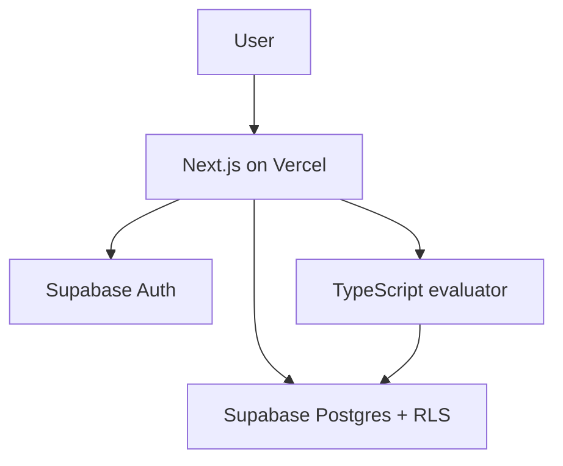

# EvalGate

**AI Agent Evaluation & Release Readiness Harness**

> This README is the implementation contract for the resume-ready MVP. Feature checkboxes should be updated only after each phase is verified.

## Problem

Prompt and agent changes can silently reduce output quality, introduce unsafe content, break required structure, or increase latency and cost. Manual prompt testing is hard to repeat and rarely produces a clear release decision.

## Solution

EvalGate gives AI product teams a focused workflow to:

1. Register reusable evaluation test cases.
2. Store versioned prompts.
3. Run selected tests with simulated or manually entered responses.
4. Score quality, safety, format, latency, and cost.
5. Produce an explainable **Ship**, **Needs Review**, or **Block** decision.
6. Review persisted results, metrics, reports, and recent activity.

The MVP uses deterministic rule-based evaluation, so it requires no paid AI API.

## Features

- [ ] Supabase email/password authentication
- [ ] Protected Next.js application routes
- [ ] Automatic default project per user
- [ ] Scenario-based test case registry
- [ ] Prompt version registry
- [ ] Deterministic response simulation and manual response entry
- [ ] Quality keyword scoring
- [ ] Forbidden-keyword safety checks
- [ ] JSON format validation
- [ ] Latency threshold scoring
- [ ] Estimated-cost threshold scoring
- [ ] Weighted total score
- [ ] Ship, Needs Review, and Block release gates
- [ ] Persisted runs and per-test results
- [ ] Live dashboard metrics
- [ ] Evaluation reports
- [ ] Derived audit timeline
- [ ] Supabase RLS isolation
- [ ] Vercel deployment

## Decision rules

| Decision | Rule |
| --- | --- |
| Ship | Average score ≥ 80 and no safety failure |
| Needs Review | Average score ≥ 60 and no safety failure |
| Block | Average score < 60 or any forbidden keyword appears |

Score weights:

- Quality: 30%
- Safety: 30%
- Format: 15%
- Latency: 15%
- Cost: 10%

## Tech stack

- Next.js App Router
- TypeScript
- Tailwind CSS
- Supabase Cloud Auth
- Supabase Cloud Postgres
- Supabase Row Level Security
- Vercel

No local Supabase, Supabase CLI, Docker, separate API server, vector database, or real AI API is required.

## Architecture summary



- Next.js renders the product and protects routes.
- Supabase Auth manages identity and sessions.
- Supabase Postgres stores seven project-scoped tables.
- RLS authorizes every data operation.
- A pure TypeScript evaluator computes scores and decisions.
- Simulated or manually entered outputs replace paid model calls in the MVP.

Detailed decisions live in:

- `docs/01_PRD.md`
- `docs/02_ARCHITECTURE.md`
- `docs/03_DATABASE_SCHEMA.md`
- `docs/04_TASKS.md`
- `docs/05_RESUME_NOTES.md`

## Routes

| Route | Purpose |
| --- | --- |
| `/` | Product landing page |
| `/login` | Sign in |
| `/signup` | Create account |
| `/dashboard` | Live evaluation metrics |
| `/test-cases` | Test case registry |
| `/test-cases/new` | Create a test |
| `/test-cases/[id]/edit` | Edit a test |
| `/prompts` | Prompt version registry |
| `/prompts/new` | Create a prompt version |
| `/prompts/[id]/edit` | Edit a prompt version |
| `/evaluations/new` | Run an evaluation |
| `/evaluations/[id]` | Inspect a run |
| `/results` | Browse per-test results |
| `/reports` | Browse evaluation reports |
| `/reports/[id]` | Review one release report |
| `/audit` | Recent project activity |

## Supabase setup

EvalGate uses a hosted Supabase project only.

1. Create a project at Supabase.
2. Open **Project Settings → API** and copy the project URL and anon key.
3. Open **SQL Editor**.
4. Run the ordered SQL files from `supabase-patches/`, beginning with:

```text
supabase-patches/001_initial_schema.sql
```

5. Verify all seven tables have RLS enabled.
6. Configure Supabase Auth URL settings:

```text
Local site URL: http://localhost:3000
Production site URL: https://YOUR_VERCEL_DOMAIN
```

7. Add any required local and production callback URLs for the chosen email-confirmation flow.

The complete baseline SQL and verification queries are documented in `docs/03_DATABASE_SCHEMA.md`.

## Environment variables

Create `.env.local` from `.env.example`:

```bash
cp .env.example .env.local
```

Required values:

```dotenv
NEXT_PUBLIC_SUPABASE_URL=https://YOUR_PROJECT_REF.supabase.co
NEXT_PUBLIC_SUPABASE_ANON_KEY=YOUR_ANON_KEY
```

Do not expose a service-role key. EvalGate does not require one for normal application behavior.
Workspace routes require a valid Supabase Auth session; unauthenticated requests redirect to `/login`.

## Development commands

```bash
npm install
npm run dev
```

Open [http://localhost:3000](http://localhost:3000).

Quality gates:

```bash
npm run lint
npm run build
```

Run both commands after every phase.

## Database patch workflow

- Apply patches manually through the Supabase Cloud SQL Editor.
- Keep applied patches immutable.
- Add a new ordered patch for every later schema change.
- Record the applied patch in the relevant commit.
- Never reset the cloud project to move between normal phases.
- Keep demo data separate from the baseline schema.

## Demo flow

1. Sign in to the default EvalGate project.
2. Show five evaluation cases covering quality, safety, format, latency, and cost.
3. Show Support Agent Prompt v1 and v2.
4. Start a run using the candidate prompt.
5. Select the test suite and inspect simulated responses.
6. Introduce or show a forbidden-keyword failure.
7. Explain the five scores and weighted total.
8. Open the Block report and its safety rationale.
9. Compare it with a previous Ship report.
10. Finish with live dashboard metrics and the audit timeline.

## Security model

- Every public table has RLS enabled.
- Profiles are scoped directly to the authenticated user.
- Projects are scoped by `owner_id`.
- Child rows are scoped through `project_id`.
- Composite foreign keys reject cross-project prompt/test/run relationships.
- Protected routes validate identity server-side.
- The browser never receives a service-role credential.

## Resume relevance

EvalGate demonstrates:

- Full-stack AI product engineering
- LLM and agent evaluation design
- Prompt versioning and scenario-based regression testing
- Explainable safety and release gates
- Latency and cost awareness
- Supabase schema design and RLS
- Next.js authentication and protected routes
- Persistent dashboards, reports, and auditability

Suggested resume line:

> Built a Next.js and Supabase Cloud evaluation harness for versioned AI prompts, with deterministic quality, safety, format, latency, and cost scoring that generates explainable Ship, Needs Review, or Block release decisions.

## MVP boundaries

EvalGate is a resume-ready engineering MVP, not a production SaaS. It intentionally excludes real model APIs, background workers, team billing, RAG, embeddings, fine-tuning, vector databases, and CI integrations.

See `docs/05_RESUME_NOTES.md` for the interview narrative, likely questions, honest limitations, and production roadmap.
