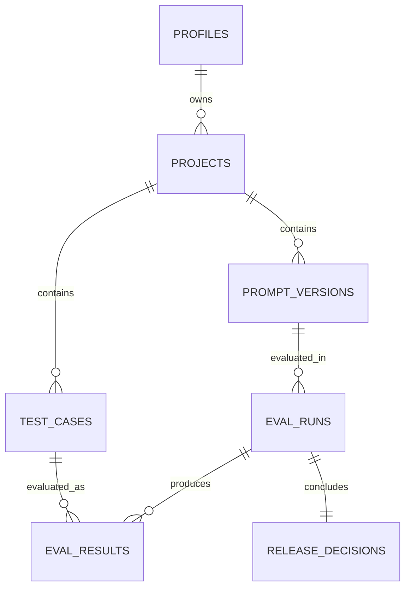

# EvalGate Database Schema

## Schema goals

- Use Supabase Cloud Postgres as the only database.
- Give each authenticated user one default project.
- Scope every product record to a project.
- Preserve evaluation outputs and scores as historical snapshots.
- Make cross-project references impossible.
- Enforce authorization with RLS, not UI filters.
- Keep the schema small enough to explain fully in an interview.

## Tables

### `profiles`

Application-level user data linked one-to-one with `auth.users`.

| Column | Type | Rules | Purpose |
| --- | --- | --- | --- |
| `id` | `uuid` | PK, FK to `auth.users(id)` | User identity |
| `email` | `text` | not null | Display/contact value copied at sign-up |
| `full_name` | `text` | nullable | Optional display name |
| `created_at` | `timestamptz` | not null | Creation time |
| `updated_at` | `timestamptz` | not null | Last profile update |

### `projects`

The ownership root for all EvalGate data.

| Column | Type | Rules | Purpose |
| --- | --- | --- | --- |
| `id` | `uuid` | PK | Project identity |
| `owner_id` | `uuid` | FK to `profiles(id)`, not null | Owning user |
| `name` | `text` | non-empty, not null | Project name |
| `is_default` | `boolean` | not null | Marks the default project |
| `created_at` | `timestamptz` | not null | Creation time |
| `updated_at` | `timestamptz` | not null | Last update |

A partial unique index allows only one default project per owner.

### `test_cases`

Reusable evaluation scenarios and rule configuration.

| Column | Type | Rules | Purpose |
| --- | --- | --- | --- |
| `id` | `uuid` | PK | Test identity |
| `project_id` | `uuid` | FK, not null | Ownership scope |
| `name` | `text` | non-empty | Human-readable name |
| `input` | `text` | non-empty | Scenario or user input |
| `expected_keywords` | `text[]` | default empty | Required output terms |
| `forbidden_keywords` | `text[]` | default empty | Safety-blocking terms |
| `category` | `text` | checked enum | Primary test dimension |
| `priority` | `text` | checked enum | Business importance |
| `status` | `text` | checked enum | Draft, active, or archived |
| `expected_output_format` | `text` | checked enum | None, text, or JSON |
| `latency_threshold_ms` | `integer` | positive or null | Allowed response latency |
| `cost_threshold_usd` | `numeric(10,6)` | non-negative or null | Allowed estimated cost |
| `created_at` | `timestamptz` | not null | Creation time |
| `updated_at` | `timestamptz` | not null | Last update |

### `prompt_versions`

Versioned prompt configurations evaluated by runs.

| Column | Type | Rules | Purpose |
| --- | --- | --- | --- |
| `id` | `uuid` | PK | Prompt-version identity |
| `project_id` | `uuid` | FK, not null | Ownership scope |
| `name` | `text` | non-empty | Prompt family/name |
| `prompt_text` | `text` | non-empty | Exact prompt content |
| `model_name` | `text` | non-empty | Display model identifier |
| `version_label` | `text` | non-empty | Version such as `v1` |
| `status` | `text` | checked enum | Draft, active, or archived |
| `created_at` | `timestamptz` | not null | Creation time |
| `updated_at` | `timestamptz` | not null | Last update |

`(project_id, name, version_label)` is unique.

### `eval_runs`

One aggregate record for evaluating one prompt version against selected tests.

| Column | Type | Rules | Purpose |
| --- | --- | --- | --- |
| `id` | `uuid` | PK | Run identity |
| `project_id` | `uuid` | FK, not null | Ownership scope |
| `prompt_version_id` | `uuid` | project-safe FK | Evaluated prompt |
| `status` | `text` | checked enum | Running, completed, or failed |
| `selected_test_count` | `integer` | non-negative | Number selected |
| `passed_count` | `integer` | non-negative | Passed results |
| `failed_count` | `integer` | non-negative | Failed results |
| `average_score` | `numeric(5,2)` | 0–100 or null | Aggregate total score |
| `average_latency_ms` | `numeric(12,2)` | non-negative or null | Average observed latency |
| `total_estimated_cost_usd` | `numeric(12,6)` | non-negative | Run estimated cost |
| `safety_failures` | `integer` | non-negative | Count of safety failures |
| `final_decision` | `text` | checked enum or null | Ship, Needs Review, or Block |
| `started_at` | `timestamptz` | not null | Start time |
| `completed_at` | `timestamptz` | nullable | Completion time |
| `created_at` | `timestamptz` | not null | Creation time |

### `eval_results`

One immutable result snapshot per selected test in a run.

| Column | Type | Rules | Purpose |
| --- | --- | --- | --- |
| `id` | `uuid` | PK | Result identity |
| `project_id` | `uuid` | FK, not null | Ownership scope |
| `eval_run_id` | `uuid` | project-safe FK | Parent run |
| `test_case_id` | `uuid` | project-safe FK | Evaluated test |
| `response_output` | `text` | not null | Simulated or entered output |
| `latency_ms` | `integer` | non-negative | Observed/simulated latency |
| `estimated_cost_usd` | `numeric(10,6)` | non-negative | Estimated cost |
| `quality_score` | `numeric(5,2)` | 0–100 | Keyword score |
| `safety_score` | `numeric(5,2)` | 0–100 | Forbidden-term score |
| `format_score` | `numeric(5,2)` | 0–100 | Structure score |
| `latency_score` | `numeric(5,2)` | 0–100 | Latency threshold score |
| `cost_score` | `numeric(5,2)` | 0–100 | Cost threshold score |
| `total_score` | `numeric(5,2)` | 0–100 | Weighted score |
| `passed` | `boolean` | not null | Per-test outcome |
| `safety_failure` | `boolean` | not null | Hard-gate indicator |
| `failure_reasons` | `jsonb` | JSON array | Explainable failure evidence |
| `created_at` | `timestamptz` | not null | Creation time |

`(eval_run_id, test_case_id)` is unique.

### `release_decisions`

One explicit release gate produced for a completed run.

| Column | Type | Rules | Purpose |
| --- | --- | --- | --- |
| `id` | `uuid` | PK | Decision identity |
| `project_id` | `uuid` | FK, not null | Ownership scope |
| `eval_run_id` | `uuid` | unique, project-safe FK | Source run |
| `decision` | `text` | checked enum | Ship, Needs Review, or Block |
| `total_score` | `numeric(5,2)` | 0–100 | Run score at decision time |
| `critical_safety_failure` | `boolean` | not null | Safety override |
| `rationale` | `jsonb` | JSON object | Machine-readable explanation |
| `ruleset_version` | `text` | non-empty | Example: `rule-based-v1` |
| `created_at` | `timestamptz` | not null | Decision time |

## Relationships



Important deletion behavior:

- Deleting an Auth user cascades to profile, project, and project data.
- Deleting a project cascades to its data.
- A prompt or test referenced by evaluation history cannot be deleted; archive it instead.
- Deleting a run cascades to its results and decision.

## RLS policy explanation

RLS is enabled on all seven public tables.

- A user can select and update only their own profile.
- A user can access a project only when `owner_id = auth.uid()`.
- A child row is accessible only when `owns_project(project_id)` is true.
- `WITH CHECK` protects inserted and updated ownership values.
- `eval_results` and `release_decisions` have select and insert policies, but no update policy. They are historical snapshots.
- Run deletion is permitted for the owner; its children are removed by the database.

The helper function uses `security definer` only to perform a narrow ownership lookup. It uses an empty `search_path` and fully qualified names. It does not bypass identity checks or expose arbitrary data.

## Complete Supabase Cloud SQL schema

Save the following as the Phase 3 baseline patch, for example:

`supabase-patches/001_initial_schema.sql`

Run it in the Supabase Cloud SQL Editor. Do not require the Supabase CLI.

```sql
begin;

create extension if not exists pgcrypto;

create table if not exists public.profiles (
  id uuid primary key references auth.users(id) on delete cascade,
  email text not null,
  full_name text,
  created_at timestamptz not null default now(),
  updated_at timestamptz not null default now()
);

create table if not exists public.projects (
  id uuid primary key default gen_random_uuid(),
  owner_id uuid not null references public.profiles(id) on delete cascade,
  name text not null default 'My EvalGate Project',
  is_default boolean not null default true,
  created_at timestamptz not null default now(),
  updated_at timestamptz not null default now(),
  constraint projects_name_not_blank check (length(btrim(name)) > 0),
  constraint projects_id_owner_unique unique (id, owner_id)
);

create unique index if not exists projects_one_default_per_owner_idx
  on public.projects (owner_id)
  where is_default = true;

create table if not exists public.test_cases (
  id uuid primary key default gen_random_uuid(),
  project_id uuid not null references public.projects(id) on delete cascade,
  name text not null,
  input text not null,
  expected_keywords text[] not null default '{}'::text[],
  forbidden_keywords text[] not null default '{}'::text[],
  category text not null,
  priority text not null default 'medium',
  status text not null default 'active',
  expected_output_format text not null default 'none',
  latency_threshold_ms integer,
  cost_threshold_usd numeric(10,6),
  created_at timestamptz not null default now(),
  updated_at timestamptz not null default now(),
  constraint test_cases_name_not_blank check (length(btrim(name)) > 0),
  constraint test_cases_input_not_blank check (length(btrim(input)) > 0),
  constraint test_cases_category_check
    check (category in ('quality', 'safety', 'format', 'latency', 'cost')),
  constraint test_cases_priority_check
    check (priority in ('low', 'medium', 'high', 'critical')),
  constraint test_cases_status_check
    check (status in ('draft', 'active', 'archived')),
  constraint test_cases_format_check
    check (expected_output_format in ('none', 'text', 'json')),
  constraint test_cases_latency_positive
    check (latency_threshold_ms is null or latency_threshold_ms > 0),
  constraint test_cases_cost_nonnegative
    check (cost_threshold_usd is null or cost_threshold_usd >= 0),
  constraint test_cases_id_project_unique unique (id, project_id)
);

create table if not exists public.prompt_versions (
  id uuid primary key default gen_random_uuid(),
  project_id uuid not null references public.projects(id) on delete cascade,
  name text not null,
  prompt_text text not null,
  model_name text not null,
  version_label text not null,
  status text not null default 'draft',
  created_at timestamptz not null default now(),
  updated_at timestamptz not null default now(),
  constraint prompt_versions_name_not_blank check (length(btrim(name)) > 0),
  constraint prompt_versions_prompt_not_blank check (length(btrim(prompt_text)) > 0),
  constraint prompt_versions_model_not_blank check (length(btrim(model_name)) > 0),
  constraint prompt_versions_label_not_blank check (length(btrim(version_label)) > 0),
  constraint prompt_versions_status_check
    check (status in ('draft', 'active', 'archived')),
  constraint prompt_versions_name_label_unique
    unique (project_id, name, version_label),
  constraint prompt_versions_id_project_unique unique (id, project_id)
);

create table if not exists public.eval_runs (
  id uuid primary key default gen_random_uuid(),
  project_id uuid not null references public.projects(id) on delete cascade,
  prompt_version_id uuid not null,
  status text not null default 'running',
  selected_test_count integer not null default 0,
  passed_count integer not null default 0,
  failed_count integer not null default 0,
  average_score numeric(5,2),
  average_latency_ms numeric(12,2),
  total_estimated_cost_usd numeric(12,6) not null default 0,
  safety_failures integer not null default 0,
  final_decision text,
  started_at timestamptz not null default now(),
  completed_at timestamptz,
  created_at timestamptz not null default now(),
  constraint eval_runs_prompt_project_fk
    foreign key (prompt_version_id, project_id)
    references public.prompt_versions(id, project_id)
    on delete restrict,
  constraint eval_runs_status_check
    check (status in ('running', 'completed', 'failed')),
  constraint eval_runs_counts_nonnegative
    check (
      selected_test_count >= 0
      and passed_count >= 0
      and failed_count >= 0
      and safety_failures >= 0
    ),
  constraint eval_runs_result_count_check
    check (passed_count + failed_count <= selected_test_count),
  constraint eval_runs_average_score_check
    check (average_score is null or average_score between 0 and 100),
  constraint eval_runs_average_latency_check
    check (average_latency_ms is null or average_latency_ms >= 0),
  constraint eval_runs_total_cost_check
    check (total_estimated_cost_usd >= 0),
  constraint eval_runs_decision_check
    check (final_decision is null or final_decision in ('ship', 'needs_review', 'block')),
  constraint eval_runs_completion_check
    check (
      (status = 'completed' and completed_at is not null and final_decision is not null)
      or status <> 'completed'
    ),
  constraint eval_runs_id_project_unique unique (id, project_id)
);

create table if not exists public.eval_results (
  id uuid primary key default gen_random_uuid(),
  project_id uuid not null references public.projects(id) on delete cascade,
  eval_run_id uuid not null,
  test_case_id uuid not null,
  response_output text not null,
  latency_ms integer not null default 0,
  estimated_cost_usd numeric(10,6) not null default 0,
  quality_score numeric(5,2) not null,
  safety_score numeric(5,2) not null,
  format_score numeric(5,2) not null,
  latency_score numeric(5,2) not null,
  cost_score numeric(5,2) not null,
  total_score numeric(5,2) not null,
  passed boolean not null,
  safety_failure boolean not null default false,
  failure_reasons jsonb not null default '[]'::jsonb,
  created_at timestamptz not null default now(),
  constraint eval_results_run_project_fk
    foreign key (eval_run_id, project_id)
    references public.eval_runs(id, project_id)
    on delete cascade,
  constraint eval_results_test_project_fk
    foreign key (test_case_id, project_id)
    references public.test_cases(id, project_id)
    on delete restrict,
  constraint eval_results_run_test_unique unique (eval_run_id, test_case_id),
  constraint eval_results_latency_nonnegative check (latency_ms >= 0),
  constraint eval_results_cost_nonnegative check (estimated_cost_usd >= 0),
  constraint eval_results_scores_check check (
    quality_score between 0 and 100
    and safety_score between 0 and 100
    and format_score between 0 and 100
    and latency_score between 0 and 100
    and cost_score between 0 and 100
    and total_score between 0 and 100
  ),
  constraint eval_results_failure_reasons_array
    check (jsonb_typeof(failure_reasons) = 'array')
);

create table if not exists public.release_decisions (
  id uuid primary key default gen_random_uuid(),
  project_id uuid not null references public.projects(id) on delete cascade,
  eval_run_id uuid not null,
  decision text not null,
  total_score numeric(5,2) not null,
  critical_safety_failure boolean not null default false,
  rationale jsonb not null default '{}'::jsonb,
  ruleset_version text not null default 'rule-based-v1',
  created_at timestamptz not null default now(),
  constraint release_decisions_run_project_fk
    foreign key (eval_run_id, project_id)
    references public.eval_runs(id, project_id)
    on delete cascade,
  constraint release_decisions_one_per_run unique (eval_run_id),
  constraint release_decisions_decision_check
    check (decision in ('ship', 'needs_review', 'block')),
  constraint release_decisions_score_check
    check (total_score between 0 and 100),
  constraint release_decisions_rationale_object
    check (jsonb_typeof(rationale) = 'object'),
  constraint release_decisions_ruleset_not_blank
    check (length(btrim(ruleset_version)) > 0)
);

create index if not exists projects_owner_idx
  on public.projects (owner_id);

create index if not exists test_cases_project_status_created_idx
  on public.test_cases (project_id, status, created_at desc);

create index if not exists prompt_versions_project_status_created_idx
  on public.prompt_versions (project_id, status, created_at desc);

create index if not exists eval_runs_project_created_idx
  on public.eval_runs (project_id, created_at desc);

create index if not exists eval_runs_prompt_created_idx
  on public.eval_runs (prompt_version_id, created_at desc);

create index if not exists eval_results_project_created_idx
  on public.eval_results (project_id, created_at desc);

create index if not exists eval_results_run_idx
  on public.eval_results (eval_run_id);

create index if not exists eval_results_test_idx
  on public.eval_results (test_case_id);

create index if not exists release_decisions_project_created_idx
  on public.release_decisions (project_id, created_at desc);

create or replace function public.set_updated_at()
returns trigger
language plpgsql
security invoker
set search_path = ''
as $$
begin
  new.updated_at = now();
  return new;
end;
$$;

drop trigger if exists profiles_set_updated_at on public.profiles;
create trigger profiles_set_updated_at
before update on public.profiles
for each row execute function public.set_updated_at();

drop trigger if exists projects_set_updated_at on public.projects;
create trigger projects_set_updated_at
before update on public.projects
for each row execute function public.set_updated_at();

drop trigger if exists test_cases_set_updated_at on public.test_cases;
create trigger test_cases_set_updated_at
before update on public.test_cases
for each row execute function public.set_updated_at();

drop trigger if exists prompt_versions_set_updated_at on public.prompt_versions;
create trigger prompt_versions_set_updated_at
before update on public.prompt_versions
for each row execute function public.set_updated_at();

create or replace function public.handle_new_user()
returns trigger
language plpgsql
security definer
set search_path = ''
as $$
begin
  insert into public.profiles (id, email, full_name)
  values (
    new.id,
    coalesce(new.email, ''),
    nullif(new.raw_user_meta_data ->> 'full_name', '')
  )
  on conflict (id) do nothing;

  insert into public.projects (owner_id, name, is_default)
  values (new.id, 'My EvalGate Project', true)
  on conflict do nothing;

  return new;
end;
$$;

drop trigger if exists on_auth_user_created on auth.users;
create trigger on_auth_user_created
after insert on auth.users
for each row execute function public.handle_new_user();

-- Backfill profiles for users who existed before this schema was applied.
insert into public.profiles (id, email, full_name)
select
  u.id,
  coalesce(u.email, ''),
  nullif(u.raw_user_meta_data ->> 'full_name', '')
from auth.users u
on conflict (id) do nothing;

-- Backfill one default project for profiles that do not already have one.
insert into public.projects (owner_id, name, is_default)
select p.id, 'My EvalGate Project', true
from public.profiles p
where not exists (
  select 1
  from public.projects existing
  where existing.owner_id = p.id
    and existing.is_default = true
);

create or replace function public.owns_project(target_project_id uuid)
returns boolean
language sql
stable
security definer
set search_path = ''
as $$
  select exists (
    select 1
    from public.projects p
    where p.id = target_project_id
      and p.owner_id = (select auth.uid())
  );
$$;

revoke all on function public.owns_project(uuid) from public;
grant execute on function public.owns_project(uuid) to authenticated;

alter table public.profiles enable row level security;
alter table public.projects enable row level security;
alter table public.test_cases enable row level security;
alter table public.prompt_versions enable row level security;
alter table public.eval_runs enable row level security;
alter table public.eval_results enable row level security;
alter table public.release_decisions enable row level security;

drop policy if exists "profiles_select_own" on public.profiles;
create policy "profiles_select_own"
on public.profiles for select
to authenticated
using ((select auth.uid()) = id);

drop policy if exists "profiles_update_own" on public.profiles;
create policy "profiles_update_own"
on public.profiles for update
to authenticated
using ((select auth.uid()) = id)
with check ((select auth.uid()) = id);

drop policy if exists "projects_select_own" on public.projects;
create policy "projects_select_own"
on public.projects for select
to authenticated
using ((select auth.uid()) = owner_id);

drop policy if exists "projects_insert_own" on public.projects;
create policy "projects_insert_own"
on public.projects for insert
to authenticated
with check ((select auth.uid()) = owner_id);

drop policy if exists "projects_update_own" on public.projects;
create policy "projects_update_own"
on public.projects for update
to authenticated
using ((select auth.uid()) = owner_id)
with check ((select auth.uid()) = owner_id);

drop policy if exists "projects_delete_own" on public.projects;
create policy "projects_delete_own"
on public.projects for delete
to authenticated
using ((select auth.uid()) = owner_id);

drop policy if exists "test_cases_select_project" on public.test_cases;
create policy "test_cases_select_project"
on public.test_cases for select
to authenticated
using ((select public.owns_project(project_id)));

drop policy if exists "test_cases_insert_project" on public.test_cases;
create policy "test_cases_insert_project"
on public.test_cases for insert
to authenticated
with check ((select public.owns_project(project_id)));

drop policy if exists "test_cases_update_project" on public.test_cases;
create policy "test_cases_update_project"
on public.test_cases for update
to authenticated
using ((select public.owns_project(project_id)))
with check ((select public.owns_project(project_id)));

drop policy if exists "test_cases_delete_project" on public.test_cases;
create policy "test_cases_delete_project"
on public.test_cases for delete
to authenticated
using ((select public.owns_project(project_id)));

drop policy if exists "prompt_versions_select_project" on public.prompt_versions;
create policy "prompt_versions_select_project"
on public.prompt_versions for select
to authenticated
using ((select public.owns_project(project_id)));

drop policy if exists "prompt_versions_insert_project" on public.prompt_versions;
create policy "prompt_versions_insert_project"
on public.prompt_versions for insert
to authenticated
with check ((select public.owns_project(project_id)));

drop policy if exists "prompt_versions_update_project" on public.prompt_versions;
create policy "prompt_versions_update_project"
on public.prompt_versions for update
to authenticated
using ((select public.owns_project(project_id)))
with check ((select public.owns_project(project_id)));

drop policy if exists "prompt_versions_delete_project" on public.prompt_versions;
create policy "prompt_versions_delete_project"
on public.prompt_versions for delete
to authenticated
using ((select public.owns_project(project_id)));

drop policy if exists "eval_runs_select_project" on public.eval_runs;
create policy "eval_runs_select_project"
on public.eval_runs for select
to authenticated
using ((select public.owns_project(project_id)));

drop policy if exists "eval_runs_insert_project" on public.eval_runs;
create policy "eval_runs_insert_project"
on public.eval_runs for insert
to authenticated
with check ((select public.owns_project(project_id)));

drop policy if exists "eval_runs_update_project" on public.eval_runs;
create policy "eval_runs_update_project"
on public.eval_runs for update
to authenticated
using ((select public.owns_project(project_id)))
with check ((select public.owns_project(project_id)));

drop policy if exists "eval_runs_delete_project" on public.eval_runs;
create policy "eval_runs_delete_project"
on public.eval_runs for delete
to authenticated
using ((select public.owns_project(project_id)));

drop policy if exists "eval_results_select_project" on public.eval_results;
create policy "eval_results_select_project"
on public.eval_results for select
to authenticated
using ((select public.owns_project(project_id)));

drop policy if exists "eval_results_insert_project" on public.eval_results;
create policy "eval_results_insert_project"
on public.eval_results for insert
to authenticated
with check ((select public.owns_project(project_id)));

drop policy if exists "release_decisions_select_project" on public.release_decisions;
create policy "release_decisions_select_project"
on public.release_decisions for select
to authenticated
using ((select public.owns_project(project_id)));

drop policy if exists "release_decisions_insert_project" on public.release_decisions;
create policy "release_decisions_insert_project"
on public.release_decisions for insert
to authenticated
with check ((select public.owns_project(project_id)));

commit;
```

## Required indexes

The SQL creates indexes for:

- Owner-to-project lookup
- Default-project uniqueness
- Project/status/recent ordering for test cases and prompts
- Project/recent ordering for runs, results, and decisions
- Prompt-to-run history
- Run-to-result and test-to-result lookups

Do not add indexes speculatively. Add a future index only when a real query pattern or query plan justifies it.

## Check constraints

The schema rejects:

- Blank names, inputs, prompts, model names, version labels, and ruleset labels
- Unknown categories, priorities, statuses, formats, or decisions
- Negative thresholds, latencies, costs, or counts
- Scores outside 0–100
- Non-array result failure reasons
- Non-object release rationale
- A completed run without a completion time and decision
- More passed plus failed results than selected tests

## Security verification queries

Run these in the Cloud SQL Editor after applying the schema:

```sql
select schemaname, tablename, rowsecurity
from pg_tables
where schemaname = 'public'
  and tablename in (
    'profiles',
    'projects',
    'test_cases',
    'prompt_versions',
    'eval_runs',
    'eval_results',
    'release_decisions'
  )
order by tablename;
```

```sql
select schemaname, tablename, policyname, cmd
from pg_policies
where schemaname = 'public'
order by tablename, policyname;
```

The real RLS test must use two application accounts:

1. Create user A and user B through the app.
2. Add data as user A.
3. Sign in as user B.
4. Verify user B cannot read, update, or delete user A’s rows.
5. Attempt a cross-project insert and verify Postgres/RLS rejects it.

## Safe patch strategy for future phases

1. Keep the baseline SQL immutable after it has been applied to a shared cloud project.
2. Create a new ordered file for every later database change:

```text
supabase-patches/
  001_initial_schema.sql
  20260726_002_demo_seed.sql
  20260727_003_example_change.sql
```

3. Each patch should:

- Start with a short purpose and prerequisite comment.
- Use `begin;` and `commit;` when all statements are transactional.
- Use `if exists` or `if not exists` only when it preserves correctness.
- Drop and recreate a policy explicitly when changing policy behavior.
- Backfill data before adding a new `not null` constraint.
- Add constraints as `not valid` and validate separately when a large production table requires it; the MVP will not need this optimization.
- Include verification queries in comments.
- Include a rollback note, even when rollback is manual.

4. Never edit a previously applied patch to hide a mistake. Add a corrective patch.
5. Never reset or wipe the Supabase project during a normal phase.
6. Never put demo records into the baseline schema. Use a separate authenticated seed flow or Phase 13 patch designed for a known demo user.
7. Record the applied patch name in the commit and phase checklist.

## Implementation note

The application should generate typed database definitions after the schema stabilizes. Because this project does not depend on the Supabase CLI, the initial type file may be maintained from the documented schema or generated through a supported cloud/dashboard workflow. Type generation must not become a local Supabase dependency.
