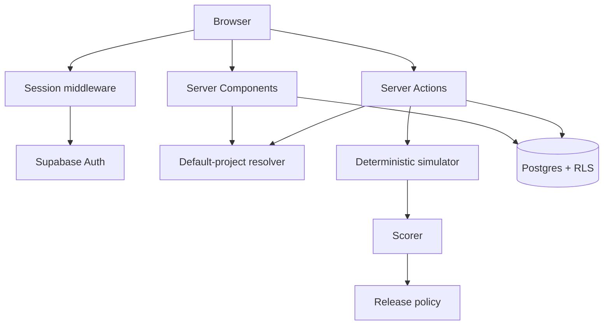

# EvalGate Architecture Deep Dive

## 1. System overview

EvalGate is a Next.js 14 App Router application backed by Supabase Cloud. Next.js renders pages and hosts Server Actions. Supabase provides Auth, cookie-compatible sessions, Postgres, and RLS. Pure TypeScript performs scoring and decisions. Evaluation is synchronous and deterministic; no model is called.



## 2. Frontend architecture

Public and authenticated areas use route groups. Data pages are mainly Server Components; forms post to Server Actions. Client Components are limited to browser state such as active navigation and pending submission. Tailwind styles the UI, while shared components implement the shell, headers, metrics, badges, empty states, and setup errors.

## 3. Backend/Supabase architecture

There is no separate API server. Backend responsibilities are divided among Server Components for reads, Server Actions for mutations, `lib/evalgate` domain helpers, Supabase Auth, Postgres tables, constraints, and RLS. Server and browser clients use the anon key; the signed-in session provides identity.

## 4. Auth flow

1. Login/sign-up actions call Supabase email/password Auth.
2. `@supabase/ssr` manages cookie sessions.
3. Middleware refreshes the session.
4. Protected route prefixes redirect signed-out users to login.
5. Signed-in users visiting auth pages redirect to dashboard.
6. Pages/actions still verify the user server-side; middleware is UX, not database authorization.

## 5. Workspace/project flow

`ensureDefaultProject` calls `auth.getUser`, reads or creates the matching profile, synchronizes email, then finds the user's oldest project or creates a default. React `cache` avoids repeated work in a render. The UI behaves as one default workspace per user, although the table can hold multiple projects and there is no switcher.

## 6. Server-side logic flows

### Test case creation

The action parses fields, validates category/priority/status, resolves the workspace, inserts with server-derived `project_id`, and revalidates the registry. Archiving updates only a row matching both ID and project.

### Prompt version flow

The prompt action validates name, text, model label, version label, and lifecycle status, resolves ownership, then creates or archives a project-scoped version. A model label is metadata, not evidence of inference.

### Evaluation run and scoring flow

1. Require one prompt and at least one unique test ID.
2. Resolve the authenticated project.
3. Fetch the prompt by ID and project; fetch tests by project, active status, and IDs.
4. Reject count mismatches as unavailable/inactive/foreign selections.
5. Insert a `running` aggregate.
6. Generate one deterministic output per case. Normal output includes expected terms; input containing `simulate incomplete answer` creates an intentionally incomplete response. Latency is fixed at 120 ms and cost at zero.
7. Normalize keywords and calculate quality, safety, format, latency, and cost.
8. Apply category weights and the priority threshold. Forbidden output always fails.
9. Insert per-test results, compute counts/average/safety failures, and complete the run.
10. Generate and insert one release decision.

### Release decision flow

Block wins for zero tests, any safety failure, or average below 70. Needs Review covers safe runs with failed tests, incomplete pass count, or average below 85. Otherwise the result is Ship. Policy is separate from case scoring.

### Reports/audit read flow

Results reads up to 50 new per-test records. Reports summarizes recent completed runs and decisions. Dashboard derives live project metrics. Audit maps test, prompt, run, and decision timestamps into a common event shape and sorts them. It is not a complete event log.

## 7. Route structure

| Route | Purpose |
| --- | --- |
| `/` | Public product story. |
| `/login`, `/signup` | Auth forms. |
| `/dashboard` | Metrics/latest decision. |
| `/test-cases`, `/test-cases/new` | Test registry/create. |
| `/prompts`, `/prompts/new` | Prompt registry/create. |
| `/evaluations` | Runner and recent runs. |
| `/evaluations/new` | Redirect to runner. |
| `/results` | Detailed case evidence. |
| `/reports` | Aggregate release evidence. |
| `/audit` | Derived activity timeline. |

## 8. Component structure

`app-shell` and `app-navigation` frame the workspace; `navbar` serves public pages; `page-header`, `metric-card`, and `release-decision-badge` present information; `empty-state` and `workspace-setup-error` distinguish missing data from failure; auth submit/logout components handle interaction. It is a focused shared set, not a full design system.

## 9. User action to database

```text
Form → Server Action validation → authenticated workspace resolution
→ project-filtered reference lookup → authenticated Supabase query
→ constraints + RLS USING/WITH CHECK → persisted row
→ revalidation/redirect → project-scoped Server Component read
```

The browser proposes record IDs but never supplies trusted owner context.

## 10. Error handling

Actions validate required/enumerated input, return concise redirect errors, and reject missing or foreign evaluation selections. Read pages distinguish empty from query errors. Workspace setup has a safe fallback. Failed evaluation persistence is marked `failed` where possible. Raw database errors are not exposed. Limitations include no typed central error model, structured tracing, or atomic run transaction.

## 11. Why suitable for a student MVP

One TypeScript codebase minimizes operations; Supabase supplies a real relational/auth boundary; Server Components reduce client plumbing; deterministic evaluation is free and demonstrable; and seven focused tables show meaningful modeling without unnecessary services.

## 12. Production changes

- Add provider adapters behind an executor interface.
- Execute idempotent runs in workers with retries, limits, and progress.
- Make completion transactional.
- Snapshot exact prompt, test, evaluator, and provider configuration.
- Add versioned suites and pairwise comparisons.
- Calibrate task metrics, model judges, and human review.
- Add organizations, roles, approvals, and scoped credentials.
- Add append-only audit where required, pagination, retention, observability, and security/load tests.
